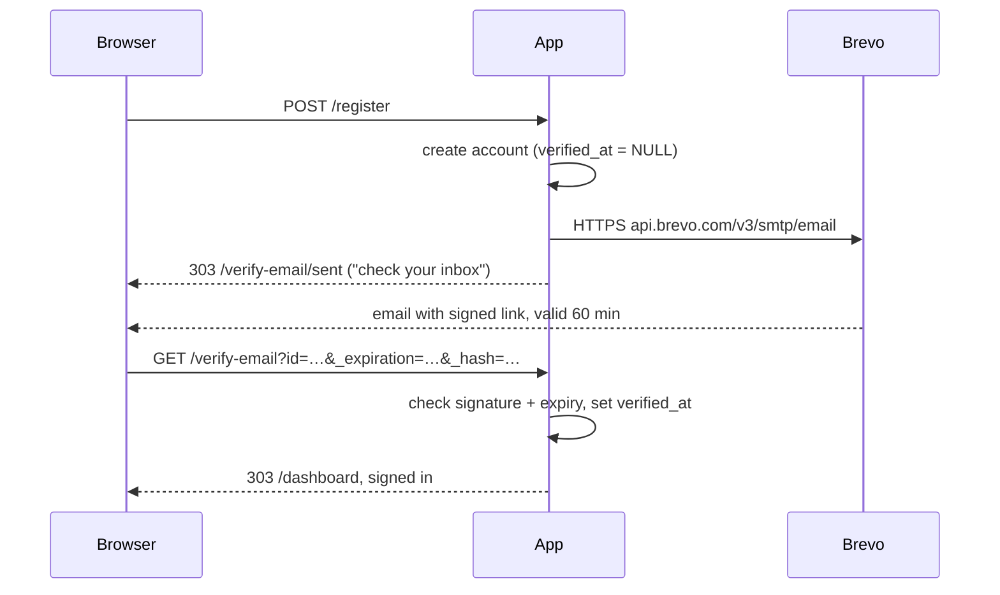

# Email verification on sign-up

Written 2026-09-12. This is the Symfony counterpart of the Brevo setup in
`save_furry_friend/ai_docs/deployment.md` (step 4 there). Brevo-side facts below
were taken from that document; re-check them against Brevo's own pages before
relying on a limit or a URL - free tiers move.

What you get: a new account cannot sign in until the link emailed to its address
has been followed. Everything below is already implemented; the steps are what
**you** still have to do on Brevo and on the host, plus how to check it works.

---

## The flow



Three rules worth knowing before you touch anything:

| Rule | Where it lives | Why |
| --- | --- | --- |
| An unverified account is refused at sign-in **after** the password matched | `src/Security/VerifiedEmailChecker.php` (`checkPostAuth`) | Symfony runs `checkPreAuth` before the password. Refusing there would tell anyone who types an address whether an account exists for it - the enumeration the form's generic "Invalid credentials." exists to prevent. |
| The link signs the account in, **once** | `src/Controller/EmailVerificationController.php::verify()` | Possessing the link is the proof of inbox control that was asked for. A used link redirects to sign-in and nothing more, so a link found later in a mailbox is not a way in. |
| Every account that existed before the deploy counts as verified | `migrations/Version20260912090000.php` | Those accounts were created when nothing was asked of them. Locking a working account out of its own calendar is a regression, not security. |

---

## What was built

| File | Role |
| --- | --- |
| `composer.json` | `symfony/mailer`, `symfony/brevo-mailer`, `symfony/http-client` |
| `config/packages/mailer.yaml` | `dsn` from `MAILER_DSN`; global `From` header from `MAILER_FROM` |
| `config/packages/security.yaml` | `user_checker`, and `/verify-email…` in the public paths |
| `migrations/Version20260912090000.php` | `app_user.verified_at`, `app_user.verification_sent_at`; grandfathers existing rows |
| `src/Entity/User.php` | `isVerified()`, `markVerified()`, `markVerificationSent()` |
| `src/Security/EmailVerifier.php` | Builds the signed link, sends the email, throttles resends, checks a followed link |
| `src/Security/VerifiedEmailChecker.php` | The sign-in refusal |
| `src/Security/EmailNotVerifiedException.php` | Its message; the one status error Symfony shows on the form as-is |
| `src/Security/InvalidVerificationLinkException.php` | Bad or expired link, told apart for the page |
| `src/Controller/RegistrationController.php` | Sends the email and redirects to "check your inbox" instead of signing in |
| `src/Controller/EmailVerificationController.php` | `/verify-email/sent`, `POST /verify-email/resend`, `/verify-email` |
| `src/Controller/SecurityController.php` | Tells the login template when to offer "send the link again" |
| `src/Command/VerificationLinkCommand.php` | `app:verification-link <email>` prints the link without emailing it |
| `templates/emails/verify_email.{html,txt}.twig` | The message |
| `templates/security/verify_email_sent.html.twig` | The inbox page, with the resend form |
| `templates/security/login.html.twig` | One-click resend under the "verify first" error |
| `templates/_flashes.html.twig`, `base.html.twig` | Flashes became a block so the sign-in screens can render them inside the card |
| `compose.override.yaml` | Mailpit for local development (`http://localhost:18025`) |
| `tests/SecurityTest.php` | The whole round-trip, the refusal, tampered/expired links, the resend throttle |

### Why the framework's `UriSigner` and not `symfonycasts/verify-email-bundle`

The bundle is what `make:registration-form` scaffolds and it does support
Symfony 8. It was not used because everything it adds is already in the
framework since 7.3: `UriSigner::sign($url, $expiry)` writes `_expiration` and
`_hash` (HMAC-SHA256 over the **whole** URL, keyed with `kernel.secret`), and
`UriSigner::verify()` throws distinct exceptions for missing, forged and expired
signatures. The account id is in the query string and therefore covered by the
signature, so a link can only ever verify the account it was issued for. Nothing
is stored for a link; there is no token table to expire or clean.

Two consequences you have to know about:

- **Links are only valid at the origin they were generated for.** The signature
  covers scheme and host. In a request that is the request's own host, so a
  browser-driven sign-up always matches. From the console (`app:verification-link`)
  it is `DEFAULT_URI` - set it to the origin the link will be opened at.
- **`APP_SECRET` is the signing key.** It must be set (Symfony refuses an empty
  one: `A non-empty secret is required.`, raised the first time anything is
  signed - i.e. at the first sign-up) and it must be unguessable, or anyone can
  mint a link that signs them in as any unverified account. Rotating it
  invalidates every link not yet followed; people ask for a new one, nothing
  breaks.

### Why the resend form says the same thing to everyone

`POST /verify-email/resend` is public. It answers *"If that address is waiting
to be verified, a new link is on its way"* whether the address is unknown,
already verified, throttled, or just emailed - otherwise the form lists
accounts. It also refuses to send twice within 60 seconds for one address
(`EmailVerifier::RESEND_COOLDOWN_SECONDS`), because a public "send an email to
this address" button with no limit is a way to flood a stranger's inbox on your
300-a-day budget. What it does not stop is a bot registering many *different*
addresses; that was true of the previous project too, and is the one risk left
open by open registration.

---

## Laravel → Symfony, for anyone coming from the previous project

| Save Furry Friend (Laravel) | This app (Symfony) |
| --- | --- |
| `MAIL_MAILER=brevo` + `BREVO_API_KEY` + `Mail::extend()` in a provider | `MAILER_DSN=brevo+api://KEY@default` - the bridge is a first-party package, no glue code |
| `MAIL_FROM_ADDRESS` / `MAIL_FROM_NAME` | one `MAILER_FROM="Name <address>"` |
| `APP_URL` | the request's host, or `DEFAULT_URI` for console-generated links |
| `MAIL_MAILER=log` | `MAILER_DSN=null://null` (nothing delivered) or Mailpit in the dev stack |
| `php artisan email:verification-link x@y` | `php bin/console app:verification-link x@y` |
| `MustVerifyEmail`, `signed` middleware, `verification.*` routes | `EmailVerifier` + `UriSigner`, `EmailVerificationController` |
| "Verification is reported, not enforced" | **Enforced**: unverified accounts cannot sign in |
| `TRUSTED_PROXIES` in `TrustProxies` middleware | `SYMFONY_TRUSTED_PROXIES` env var, read by the framework with no config |

---

## Step by step

### 0. See it work locally first

```bash
make up                       # php, nginx, postgres and Mailpit
```

Open <http://localhost:8080/register>, create an account, and read the email at
<http://localhost:18025>. The dev overlay points `MAILER_DSN` at Mailpit and
`DEFAULT_URI` at `http://localhost:8080`, so both the emailed link and the one
`make console ARGS="app:verification-link you@example.test"` prints work when
opened in your browser. Mailpit's UI is on **18025**, not its default 8025, for
the same reason Postgres is on 15432: another project's Mailpit is probably already
on 8025 (`MAILPIT_PORT` overrides it).

The migration runs on boot (`docker/php/entrypoint.sh`); look for
`Successfully migrated to version: DoctrineMigrations\Version20260912150000` in
`make logs ARGS=php`. The verification columns are part of that single schema:

```bash
make db
booking_calendar=# SELECT email, verified_at, verification_sent_at FROM app_user;
```

`make test` forces `MAILER_DSN=null://null` inside the container so the suite
never talks to Mailpit; `vendor/bin/phpunit` on the host reads `null://null`
from `.env` and asserts against Symfony's in-memory mail log.

### 1. Brevo - reuse the account you already have

The account is per person, not per app. What you did for Save Furry Friend
carries over; what does not is the API key.

| | Already done for SFF? | Do now |
| --- | --- | --- |
| Transactional sending activated (step 4.1 there) | Yes, account-wide | Nothing. Confirm under **Transactional** that the SFF sends show up in Logs - that proves activation |
| Validated sender (4.2) | Yes, your Gmail address | Reuse it. The display name is per message (`MAILER_FROM`), so "Booking Calendar <you@gmail.com>" needs no new sender. Adding a second sender with the same address is harmless if you prefer a separate entry - it is another 6-digit OTP to the same inbox |
| API key (4.3) | Exists, named for SFF | **Create a second key for this project**: <https://app.brevo.com/settings/keys/api> → *Generate a new API key* → name it e.g. `booking-calendar-<host>`, **no expiration**, do **not** tick "Create MCP server API key" (it deactivates the key you just made). Copy it now; it is shown once. Two keys mean rotating or revoking one project never touches the other |
| API-key IP blocking off (4.4) | Yes, account-wide | Nothing. Re-check <https://app.brevo.com/security/authorised_ips> is still *deactivated*; a 401 on every send a month from now is the symptom of it having armed itself |

It is the **API** key (`xkeysib-…`), not the SMTP key. The DSN below speaks HTTPS
to `api.brevo.com` on 443, so it works from hosts that block outbound SMTP
ports, exactly as the previous project needed.

### 2. Set the environment on the host

On Render these are the Blueprint's prompted values; the deployment walkthrough
([deployment.md](deployment.md)) goes through them in order. On any other host,
the platform's environment/secrets screen. Never `.env` in git.

```ini
APP_ENV=prod
APP_SECRET=<openssl rand -hex 32>                 # signs the links - REQUIRED, unguessable
DATABASE_URL=postgresql://…&sslmode=require       # see deployment.md

MAILER_DSN=brevo+api://xkeysib-…@default          # the API key, not the SMTP key
MAILER_FROM="Booking Calendar <your.validated@gmail.com>"

# Only needed for links printed by app:verification-link; the web flow uses the
# request's own host. Set it to the public origin regardless - it is one line.
DEFAULT_URI=https://your-public-host

# NOT needed on Render: the single-container vhost derives HTTPS from
# X-Forwarded-Proto itself. Elsewhere, only if the app sits behind a
# TLS-terminating proxy AND the links in the emails come out as http://…
SYMFONY_TRUSTED_PROXIES=REMOTE_ADDR
```

One value per row; get one wrong and the failure looks like a different problem:

| Value | Wrong value looks like |
| --- | --- |
| `MAILER_DSN` scheme not `brevo+api` | `brevo+smtp` needs port 465 - blocked on Render-class hosts - and a username/password pair, not the key. Plain `brevo://` is the same as `brevo+smtp://` |
| `MAILER_FROM` address ≠ a validated Brevo sender | `Unable to send an email: sender not valid (code 400)` in the log; the browser sees *"Your account was created, but the verification email could not be sent"* |
| `APP_SECRET` empty | `InvalidArgumentException: A non-empty secret is required.` on the first sign-up |
| `APP_SECRET` changed after emails went out | Every outstanding link reads *"That verification link is not valid"*; new ones work |
| `DEFAULT_URI` ≠ where the console link is opened | Console-printed links read *"not valid"*; emailed links are unaffected |

If the key ever contains `@`, `/`, `:` or `%`, URL-encode it in the DSN - the DSN
goes through `parse_url()`. Current Brevo keys are `xkeysib-` plus hex and
alphanumerics, which is safe as-is.

### 3. Deploy

Nothing manual. The image already installs the three packages (`composer install
--no-dev` in the `vendor` stage) and the entrypoint applies the migration on
boot. Watch the boot log for the migration line quoted in step 0.

If the platform builds from git, make sure `composer.lock` and `symfony.lock`
are committed alongside the code - they carry the new packages.

### 4. Test it, in this order

```bash
# 1. The credential and the activation gate, independent of the app.
#    201 + messageId = good. 401 = wrong key (probably the SMTP one).
#    402 = transactional sending not activated. 400 sender not valid = From mismatch.
curl -i -X POST https://api.brevo.com/v3/smtp/email \
  -H "api-key: $BREVO_API_KEY" -H 'content-type: application/json' \
  -d '{"sender":{"email":"your.validated@gmail.com","name":"Booking Calendar"},
       "to":[{"email":"you@somewhere.else"}],
       "subject":"probe","htmlContent":"<p>probe</p>"}'

# 2. Through the app: register with an address you can read, on the live site.
#    Expect /verify-email/sent, then the email within a minute
#    (From: you@<account>.t-sender-sib.com, "Sent with Brevo" footer - both
#    expected on the free plan).

# 3. Try to sign in BEFORE following the link: "Verify your email address
#    before signing in", with a "Send the link again" button.

# 4. Follow the link: dashboard, signed in, "<address> is verified." banner.
#    Follow it again after signing out: sign-in page, not signed in.
```

Delivery is visible under **Transactional → Logs** in Brevo. A `201` means Brevo
accepted the message, not that it landed; spam-foldering is invisible to the
app.

### 5. Operating it

| Need | Do |
| --- | --- |
| Someone never gets the email | They can ask again from the sign-in page (right password) or `/verify-email/sent`; one email per address per minute. If it still fails, `php bin/console app:verification-link their@address` prints the link (open it in a **private window** - following it signs that browser in as them) |
| Who is waiting? | `SELECT email, created_at, verification_sent_at FROM app_user WHERE verified_at IS NULL` |
| Force-verify without a browser | `UPDATE app_user SET verified_at = NOW() WHERE email = '…'` - the column is the whole state |
| Change how long a link lives / the resend gap | `EmailVerifier::LINK_LIFETIME_SECONDS` (3600) / `RESEND_COOLDOWN_SECONDS` (60) |
| Stop sending, keep the rule | `MAILER_DSN=null://null` and hand out links from the console |
| Stop the rule | Not a switch; it would mean removing the `user_checker` line in `security.yaml` and restoring the sign-in at the end of `RegistrationController::register()` |

---

## Troubleshooting

| Symptom | Cause |
| --- | --- |
| Sign-up works, no email, nothing in Brevo's logs, no error | `MAILER_DSN` is still `null://null`. `php bin/console debug:config framework mailer` shows what is in effect |
| `Unable to send an email: Key not found (code 401)` | Wrong key - most often the **SMTP** key pasted where the API key goes |
| Worked for weeks, now `(code 401)` on every send | Brevo's IP allow-list armed itself. Step 1, last row |
| `(code 402)` / `account_under_validation` | Transactional sending not activated on that account |
| `sender not valid (code 400)` | `MAILER_FROM` is not exactly a validated sender |
| `(code 429)` | Rate limited; wait for `x-sib-ratelimit-reset` |
| `Password is not set` or a connection error on port 465 | The DSN is `brevo://` or `brevo+smtp://`; it must be `brevo+api://` |
| `Unable to send emails via "brevo" as the bridge is not installed` | `symfony/brevo-mailer` missing from the image - `composer.lock` not committed, or a stale build |
| Links in emails start with `http://` on an https site | The app is behind a proxy it does not trust, so it sees the proxy's plain-HTTP hop. Set `SYMFONY_TRUSTED_PROXIES=REMOTE_ADDR` (trust whatever connects directly - right for one PaaS proxy in front of one container) or `private_ranges`. The links still *work* if the platform redirects http→https with the query intact; they are just ugly until this is set |
| Every link says "not valid", including brand-new ones | `APP_SECRET` differs between the process that sent and the one that checks (two instances with different secrets, or a rotated value) - or the host in the link ≠ the host the browser used |
| Console link says "not valid", emailed links work | `DEFAULT_URI` does not match the origin you opened it at |
| An account that existed before the deploy cannot sign in ("Verify your email address…") | The migration's `UPDATE` did not run for it - it was created between migration and deploy, or the migration was skipped. Force-verify it (step 5) |
| Sends succeed, nothing arrives | Past the 300/day cap Brevo queues ~1,000 then **silently drops**; or spam-foldered |
| `Bind for 0.0.0.0:8025 failed: port is already allocated` on `make up` | Another Mailpit. `MAILPIT_PORT=18026 make up` |
